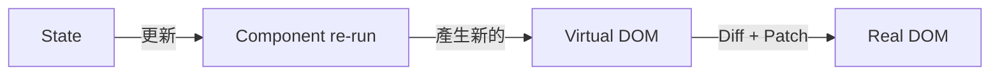

# 假設的代價：Virtual DOM 的成本

---
layout: center
transition: slide-left
---

- Virtual DOM 讓 UI 一致性更高，但同時：
<v-clicks class="list-disc pl-8" transation="fade">

  - 帶來額外的運算負擔  
  - 導致無法預期的效能尖峰  
  - 在大型專案中成為渲染瓶頸

</v-clicks>
<v-click>

- 即使有 memo / useCallback / useMemo...  
  我們仍在對抗同一個問題：**重算的浪費**

</v-click>

---

<v-click>
React 一直努力讓這條路變得更快，
但從沒改變過「需要比對」這件事。
</v-click>
