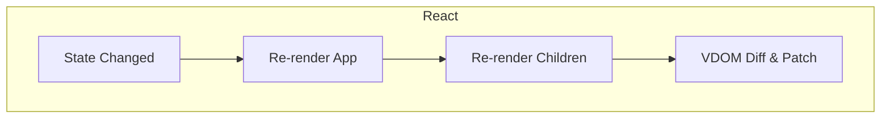
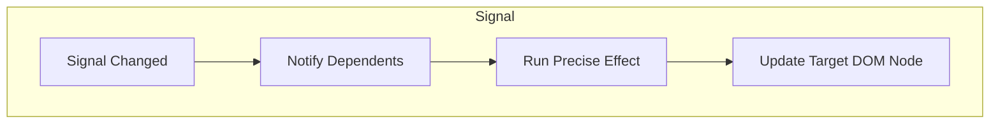

# 實驗：同樣的更新，不同的代價
## React 重算整張圖 vs Signal 只動受影響節點

---
layout: two-cols
transition: slide-left
mdc: true
---

### React（Pull Model）
```jsx {all|2|3|7|13-21|14|15|17|2|3|7|13|all}
export default function App() {
  const [count, setCount] = useState(0);
  console.log("App rendered");
  return (
    <>
      <Header />
      <Counter count={count} setCount={setCount} />
      <Footer />
    </>
  );
}

function Counter({ count, setCount }) {
  console.log("Counter rendered");
  const clickEvt = () => setCount(count + 1);
  return (
    <button onClick={clickEvt}>
      {count}
    </button>
  );
}

```

::right::

### Signal（Push-then-Pull Model）
```tsx {all|1|4|8|14-21|15|17-19|all}
const { get: count, set: setCount } = signal(0)

function App() {
  console.log("App rendered") // 只在初次 render
  return (
    <>
      <Header />
      <Counter />
      <Footer />
    </>
  )
}

function Counter() {
  console.log("Counter rendered") // 只有 count 改變時
  return (
    <button onClick={() => setCount(count() + 1)}>
      {count()}
    </button>
  )
}
```
---

<v-clicks transition="fade"> 

## React 為什麼會這樣？
- 因為它是「render function 模型」：
  - state 改變 → render function 重新執行 → child 也重新建立。
  - 雖然 React 用 diff 避免真正重繪 DOM，但運算成本仍在。 
- Signal 則是「依賴圖模型」：
  - 狀態改變時，框架從資料層就知道誰該更新，無需整棵重跑。
 
</v-clicks>

---

### 概念對比





<v-clicks transition="fade"> 

- React：**Render → Diff → Commit**（整體重建，結果正確） 
- Signal：**Track → Compute → Flush**（依賴驅動，更新精準） 
- 這不是單純「效能優化」，而是**心智模型的改變**。 

</v-clicks>
 