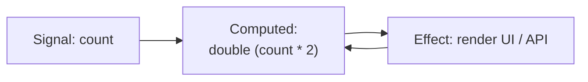

# Dependency Tracking
## 讓資料自己記得誰在依賴它
---
layout: center
---
### 🧭 什麼是 Dependency Tracking？

<v-clicks>

- 一種**自動記錄資料依賴關係**的機制。
- 當資料變動時，系統能精準觸發必要的重算或副作用。
- 是 fine-grained reactivity 的**心臟**。

</v-clicks>

<v-click>

> 想像 Excel：  
> 改了一格數值，所有依賴它的儲存格自動重算。  
> 這就是 Dependency Tracking 的核心精神。
</v-click>

---

### 🧩 三個核心角色

| 角色 | 職責 | 類比 |
|------|------|------|
| **Signal** | 原始資料來源 | Excel 儲存格 |
| **Computed** | 基於 Signal 的純函式衍生值 | 公式欄位 |
| **Effect** | 與外界互動的副作用 | 畫面更新 / API 請求 |

<!--  -->


<v-click>

三者形成一張 **有向依賴圖（Graph）**，  
每個變動都沿著邊精準傳播，不浪費多餘計算。
 
</v-click>

---
layout: two-cols
---

### ⚙️ 運作原理：三步驟

#### 1️⃣ 收集（Tracking）

<v-clicks>

- 執行 Computed 或 Effect 時，getter 會自動記錄目前取到的 Source。
- 建立「誰依賴誰」的連結，存進一張 dependency graph。
</v-clicks>

::right::

```ts
export interface Computation {
    dependencies: Set<Set<Computation>>;
    execute: () => void;
}
const effectStack: Computation[] = [];
export function subscribe(
  current: Computation,
  subscriptions: Set<Computation>
): void {
    subscriptions.add(running);
    current.dependencies.add(subscriptions);
}
function createSignal<T>(value: T) {
    const subscribers = new Set<Computation>();
    const getter = () => {
        const currEffect = effectStack[effectStack.length - 1];
        if (currEffect) subscribe(currEffect, subscribers);
        return value;
    };
    const setter = (newValue: T) => {
        if (newValue === value) return;
        value = newValue;
        subscribers.forEach(sub => sub.execute());
    };
    return { getter, setter };
}
```

---

#### 2️⃣ 通知（Notification）

<v-clicks>

- 當某個 Source 改變時 → 通知所有相關 Computed / Effect。  
- 每個 Computation 都會先清除舊依賴，再重新建立。  
- 避免動態依賴下「漏追蹤」或「殘留」的問題。  

</v-clicks>

```ts
function effect(fn: () => void) {
  const runner: Computation = {
    execute: () => {
      cleanup(runner)
      runWithStack(runner, fn)
    },
    dependencies: new Set()
  }
  runner.execute()
}

function cleanup(comp: Computation) {
  comp.dependencies.forEach(dep => dep.delete(comp))
  comp.dependencies.clear()
}

```

---

#### 3️⃣ 排程（Scheduling）
<v-clicks>

- 為避免重複觸發與效能浪費，Scheduler 將多個更新批次化（batch）。  
- 通常透過 `queueMicrotask()` 或 `requestAnimationFrame()`。

</v-clicks>

```ts
function schedule(job: () => void) {
  queueMicrotask(job)
}
```

<v-click>

> 關鍵目的：「讓多次寫入只導致一次重算」，維持畫面更新的流暢度與一致性。

</v-click>

---

### ⚖️ 動態依賴：棘手的挑戰

```ts
effect(() => {
  if (userId()) {
    fetchProfile(userId())
  }
})

```

<v-clicks>

- 當 `userId` 改變時，需要清理先前建立的依賴（舊 fetch 不該再更新）。  
- 透過 runtime 的 cleanup 機制，重新追蹤新的依賴路徑。

</v-clicks>
<v-click>

這也是為什麼在 Signal 系統中，Effect 通常都帶有「自動解除訂閱」機制。

</v-click>

---
layout: center
---

### 🧠 結語：依賴追蹤的意義

<v-clicks>

- Dependency Tracking 是 fine-grained reactivity 的神經網路。  
- 它讓資料變動能沿著明確的依賴邊傳播，只更新必要的節點。  
- 掌握這個原理，你就理解了 Signal 系統的底層邏輯。

</v-clicks>

<v-click>

若要進一步研究，就能從這個基礎延伸出更多主題：  

- Scheduler 優先權策略
- DevTools 觀察依賴圖
- Atomic Transaction / Batch 機制

這些內容在我這次[IT 邦鐵人賽的系列文章](https://ithelp.ithome.com.tw/users/20129020/ironman/8219)都有展開講解。

</v-click>

<v-click>

### 今天的講解就這裡，有興趣的朋友可以追蹤或訂閱我的文章

</v-click>
