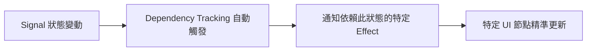

# Fine-grained Reactivity 是什麼？

---

<v-clicks class="list-disc" transtion="fade">

- 每個節點知道誰依賴自己。
- 當一個 signal 改變時，只更新有關聯的 effect。
- 不需要 Diff，不需要重建樹。

</v-clicks>

<v-click>

## React 重新算「整個結果」，Signal 只更新「必要過程」。

</v-click>

<v-click>

### 一個從 UI 出發，另一個從資料出發。

</v-click>