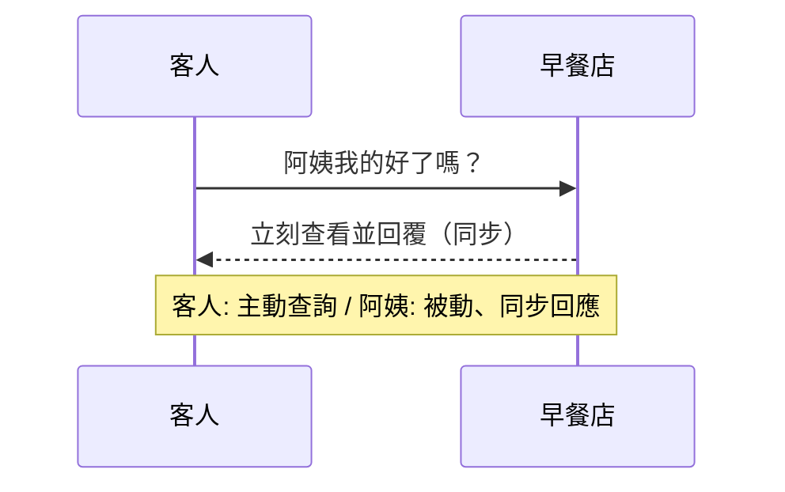
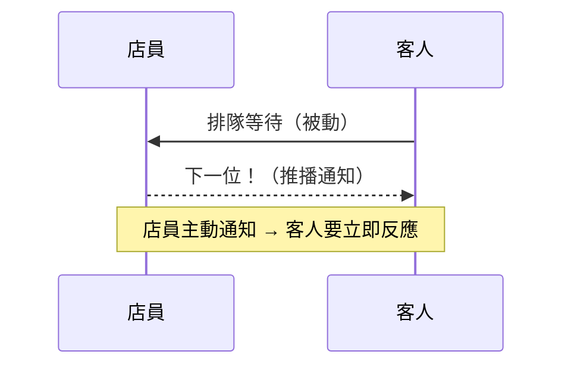
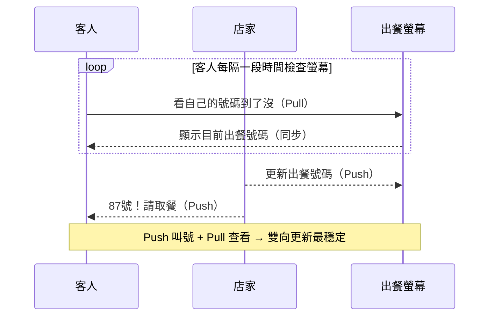

# Push vs Pull

---
layout: two-cols
transition: slide-left
---
### 生活案例：Pull-based
早餐店點餐為例

::right::

<v-clicks class="pt-8">
 
- **提供者（阿姨）**：被動方   
- **取用者（帥哥/美女）**：主動方  
- **動作（主動問）**：同步回應  

</v-clicks>

---
layout: two-cols
transition: slide-left
---

### 生活案例：Push-based
賣場排隊結帳為例

::right::

<v-clicks class="pt-8">

- **提供者（店員）**：主動方  
- **取用者（客人）**：被動方  
- **動作（下面一位）**：同步 / 非同步 (店員換班)  

</v-clicks>

---
layout: two-cols
transition: slide-left
---

### 生活案例：Push-Pull
買手搖飲料

::right::

<v-clicks class="pt-8">

- **提供者（店員）**：主動方  
- **取用者（客人）**：主動方  
- **動作（主動問 / 主動通知）**：同步 / 非同步  

</v-clicks>

<v-click>
  

  Signals runtime 就是這個模式 
  

  

  Push 建立資料變動 → Pull 批次 flush effect → 負載平衡、更新精準。
  

</v-click>
