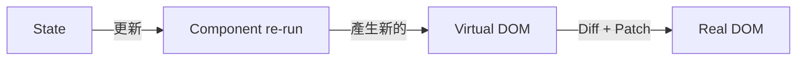

# React 的核心假設

---

## 「資料變化是不可預測的」

- React 的整個設計，建立在這個前提上。  

<v-clicks class="list-disc" transation="fade">

- 因此它必須在每次 state 改變時：  
  - 建立新的 Virtual DOM 快照  
  - 比對舊快照與新快照的差異  
  - 重新渲染需要更新的部分

</v-clicks>

<v-click>

</v-click>

---
layout: center
class: text-center
transition: fade
---
這個假設在 2012 年是合理的。  
那時前端缺乏可靠的資料觀測機制，  
Virtual DOM 成為一個優雅的折衷方案。

<v-click>

> 但十年後，這個假設還成立嗎？

</v-click>