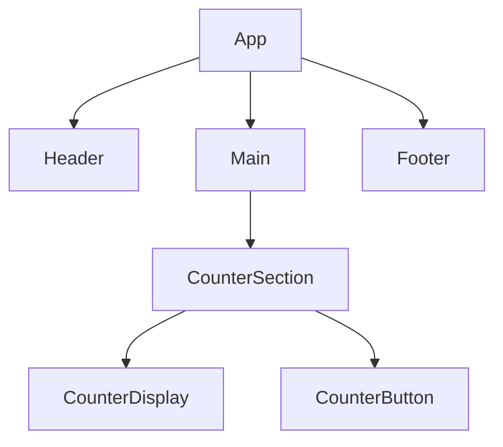
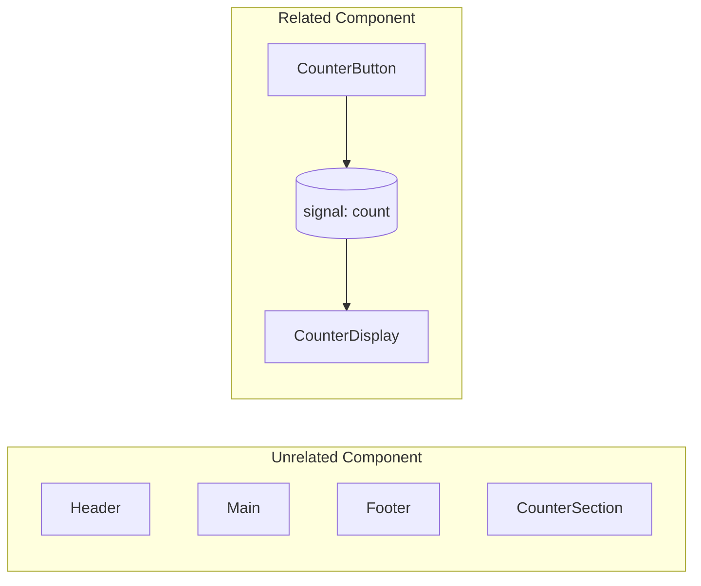

# 什麼是 Signals？

---

## Signals 是資料流動的圖(Graph)


Signals 讓資料流變得像神經網路一樣精準，而不是每次都打掉重練。

---
layout: center
---
## 為什麼需要 Signal?


---
layout: two-cols
transition: slide-left
---

### React 如何處理 Component Tree
<!--  -->


::right::

<v-clicks class="pt-8">

- React 的重渲染是「沿著這棵樹往下跑」。
- 當 CounterButton 的狀態改變 → CounterSection、Main、App 可能都被迫重跑。
- 這是一種 結構式更新：由上而下，猜測哪裡需要改。

</v-clicks>

---
layout: two-cols
transition: slide-left
---

### Signals Data Graph 的處理方式
<!--  -->


::right::

<v-clicks class="pt-8">

- 這是同一個畫面，但這次不是「誰包誰」，而是「誰用誰」。
- CounterButton 改變 count，count 同步通知所有依賴它的節點：
  - CounterDisplay 顯示新數字
  - 其他無關元件（Footer、Main...）完全不受影響
- 這是一種 資料式更新：資料知道誰用到它，直接「精準推送」。
</v-clicks>

---

### 核心差異一覽

| React 思維        | Signal 思維               |
| --------------- | ----------------------- |
| 元件之間的父子結構       | 狀態之間的依賴圖                |
| 從上往下 re-render  | 由資料主動通知                 |
| 更新範圍大，靠 memo 優化 | 更新精準，靠 dependency graph |
| 描述「UI 長什麼樣」     | 描述「資料怎麼流動」              |

---

### Signal 的術語與 React 類比

| 術語 | React 類比 | 功能 |
|---|---|---|
| **Source / Signal** | `useState` 的 state 變數 | 最原始、可寫入的資料節點 |
| **Computed / Derivation** | `useMemo` | 由 Signal 衍生、具快取的純函式 |
| **Effect / Reaction** | `useEffect` | 依賴變化後執行副作用 |
| **Batch / Transaction** | `unstable_batchedUpdates` | 將多次寫入壓縮為一次傳播 |
| **Graph / Dependency Map** | React Fiber | 追蹤資料依賴的有向圖 |

---

### Signal 的心智圖


---

### Auto-tracking：讓依賴自動連線
 
**React**
```ts {all|3|all}
useEffect(() => {
  console.log(a, b)
}, [a, b])
```

**Fine-grained (signal)**
```ts {all|2|all}
effect(() => {
  console.log(a.get(), b.get())
})
```

- Signal 自動追蹤 scope 內被讀取的值。

---
layout: center
---

### Fine-grained 的核心價值
<v-clicks> 

- **Signal**：最小可觀測單元，把「要不要重算」綁在值上  
- **Computed / Effect**：把邏輯與副作用分離，讓 UI 更新變得可預測  
- **Scheduler**：批次協調更新順序，確保一致性與效能  

</v-clicks>
<v-click> 

<h4 class="my-4"><b>Fine-grained Reactivity</b></h4>  
<p class="border-l-4 border-[#00e6b8] border-solid pl-4">不再以「元件」為界，而是以「資料」為界。</p> 
<p class="border-l-4 border-[#00e6b8] border-solid pl-4">每一次變動，都是<b>可被追蹤、可被推導</b>的結果。</p>

</v-click>

